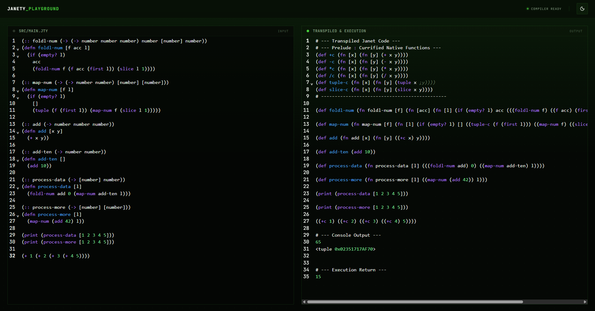

# Janety

<div align="center">

### A typed functional language that compiles to Janet

**Janety** is an experimental language ecosystem designed around a simple idea:

> **Bring static guarantees, a modern developer experience and a functional syntax on top of the Janet runtime without sacrificing simplicity.**

It combines a **Rust compiler core**, a **Janet execution engine**, **WebAssembly bindings**, **Svelte applications**, and a **cross-platform desktop environment** inside a single monorepo.

---




</div>

---

# Table of contents

- [Vision](#vision)
- [Why Janety exists](#why-janety-exists)
- [Core principles](#core-principles)
- [Features](#features)
- [Global architecture](#global-architecture)
- [Compilation pipeline](#compilation-pipeline)
- [Compiler deep dive](#compiler-deep-dive)
- [Execution engine](#execution-engine)
- [WebAssembly integration](#webassembly-integration)
- [Monorepo organization](#monorepo-organization)
- [Developer experience](#developer-experience)
- [Technology choices](#technology-choices)
- [Folder structure](#folder-structure)
- [Installation](#installation)
- [Development workflow](#development-workflow)
- [Build](#build)

---

# Vision

Janety is not simply a language.

It is an **end-to-end language engineering platform** whose objective is to build a modern ecosystem around Janet.

The project sits at the intersection of:

- compiler engineering
- type systems
- runtime embedding
- WebAssembly
- desktop applications
- modern frontend tooling

The architecture is intentionally modular so every subsystem can evolve independently.

---

# Why Janety exists

Janet is extremely elegant and lightweight.

However, dynamic languages often lack:

- static guarantees
- rich editor tooling
- early diagnostics
- typed abstractions
- ergonomic application environments

Janety addresses this by introducing a compilation pipeline:

```text
Janety Source
      │
      ▼
Parser
      │
      ▼
AST
      │
      ▼
Semantic Analysis
      │
      ▼
Type Checking
      │
      ▼
Janet Transpilation
      │
      ▼
Janet Runtime
```

Instead of replacing Janet, Janety augments it.

---

# Core principles

## Simplicity over complexity

Every subsystem remains understandable.

No hidden magic.

## Separation of responsibilities

Parsing, semantics, execution and UI layers are isolated.

## Progressive compilation

Each stage transforms data into a richer representation.

## Runtime independence

The compiler can target:

- native Janet runtime
- WebAssembly
- browser applications
- desktop applications

## Developer-first architecture

The monorepo is optimized for:

- maintainability
- scalability
- discoverability
- extensibility

---

# Features

## Language features

- Functional syntax
- Lambda expressions
- Currified functions
- Static type annotations
- Conditional expressions
- Lists
- Function composition
- Symbol management

## Compiler features

- Recursive descent parsing via Chumsky
- Semantic analysis
- Type checking
- AST transformations
- Janet code generation
- Diagnostics aggregation

## Runtime features

- Embedded Janet VM
- Native execution
- WebAssembly support
- Browser compilation

## Platform features

- Web application
- Desktop application (Tauri)
- Shared UI packages
- Shared state management

---

# Global architecture

```text
                           ┌─────────────────────┐
                           │     Applications    │
                           │                     │
                           │  Web     Desktop    │
                           └──────────┬──────────┘
                                      │
                     ┌────────────────┴──────────────┐
                     │                               │
             ┌───────▼────────┐             ┌────────▼────────┐
             │ Shared Packages │             │  Janety Core    │
             │                 │             │                  │
             │ UI              │             │ Compiler         │
             │ Features        │             │ Semantics        │
             │ State           │             │ Transpiler       │
             │ Types           │             │ Runtime          │
             └─────────────────┘             └──────────────────┘
```

The project deliberately isolates business logic inside `janety-core`.

Everything else becomes a consumer.

---

# Compilation pipeline

## 1. Parsing

**Responsibility**

Transform source code into a structured AST.

**Technology**

`chumsky`

**Why**

Compared to handwritten parsers:

✅ composable

✅ expressive

✅ easy to maintain

✅ excellent error recovery

---

## 2. Abstract Syntax Tree (AST)

The AST acts as the single source of truth.

```rust
Expr
├── Num
├── Str
├── Sym
├── List
├── Call
├── Lambda
└── If

TopLevel
├── TypeSignature
├── Defn
└── Expr
```

Why?

Because every compiler stage should operate on stable structures instead of raw text.

---

## 3. Semantic analysis

The semantic layer validates program meaning.

Responsibilities:

- symbol resolution
- environment management
- type validation
- compatibility checks

This prevents invalid programs from reaching runtime.

---

## 4. Type checking

The type system uses an environment-based approach.

```text
TypeEnv
 │
 ├── primitives
 ├── functions
 ├── collections
 └── user declarations
```

Supported abstractions:

```text
Named
List
Function
```

Compatibility rules are centralized.

This architecture makes future additions straightforward.

Examples:

- generics
- algebraic data types
- inference
- constraints

---

## 5. Janet transpilation

The compiler intentionally transpiles instead of generating machine code.

Why?

Because Janet already provides:

- mature runtime
- garbage collection
- ecosystem
- portability

The transpiler focuses exclusively on semantic translation.

Example:

```text
Janety

(+ 5 3)

↓

Janet

(+c 5 3)
```

A prelude injects currified wrappers.

Benefits:

- functional consistency
- predictable execution
- minimal runtime complexity

---

# Compiler deep dive

## Parser (`parser.rs`)

Responsibilities:

```text
Source
 │
 ├── identifiers
 ├── literals
 ├── expressions
 ├── lists
 ├── calls
 ├── lambdas
 └── conditionals
```

Design decision:

Recursive combinators instead of stateful parsing.

Advantages:

- composability
- readability
- lower maintenance cost

---

## AST (`ast.rs`)

Responsibilities:

- represent syntax
- decouple stages
- ensure deterministic transformations

Why not manipulate strings?

Because compiler passes become impossible to scale.

---

## Semantic engine (`semantics/`)

Responsibilities:

```text
AST
 │
 ▼
Type Environment
 │
 ▼
Validation
 │
 ▼
Diagnostics
```

Design goal:

Keep semantic rules independent from parsing.

---

## Transpiler (`transpiler.rs`)

Responsibilities:

```text
AST
 │
 ▼
Janet AST equivalent
 │
 ▼
Janet source code
```

Why source-to-source?

Because it remains:

- debuggable
- inspectable
- extensible

Generated code can always be audited.

---

# Execution engine

Native execution is delegated to Janet.

```text
Janety
 │
 ▼
Transpiler
 │
 ▼
Janet code
 │
 ▼
Embedded Janet VM
 │
 ▼
Execution result
```

The Rust VM layer handles:

- FFI boundaries
- memory safety
- execution status
- console capture
- runtime diagnostics

---

# WebAssembly integration

Janety exposes compiler capabilities to browsers.

```text
Browser
 │
 ▼
WASM Binding
 │
 ▼
Rust Compiler
 │
 ▼
Structured Result
```

Benefits:

- no backend required
- instant feedback
- offline support
- portable compiler

---

# Monorepo organization

The repository is split into bounded contexts.

```text
apps/
├── web
└── tauri

crates/
└── janety-core

packages/
├── core
├── features
├── state
├── ui
├── eslint-config
└── typescript-config
```

---

# Folder structure

```text
crates/janety-core
│
├── ast.rs
├── parser.rs
├── transpiler.rs
├── vm.rs
├── wasm.rs
├── result.rs
└── semantics/
    ├── env.rs
    └── typeck.rs

apps/
├── web
└── tauri

packages/
├── ui
├── features
├── state
└── core
```

---

# Architecture patterns

## Pipeline Architecture

Each stage transforms immutable data.

```text
Input
→ Parse
→ Analyze
→ Validate
→ Generate
→ Execute
```

## Layered Architecture

Each layer owns one responsibility.

```text
UI

↓

Compiler API

↓

Compiler Core

↓

Janet Runtime
```

## Monorepo Architecture

Shared resources are centralized.

Benefits:

- code reuse
- synchronized versions
- reduced duplication

---

# Performance considerations

Several decisions optimize performance.

### Rust core

Zero-cost abstractions.

### Janet reuse

Avoid reinventing a runtime.

### WASM compilation

Near-native browser execution.

### Tauri

Minimal desktop footprint.

### Shared packages

Reduced bundle duplication.

---

# Safety & reliability

Current safeguards include:

- compile-time validation
- semantic isolation
- type compatibility checks
- runtime encapsulation
- safe FFI boundaries

---

# Developer experience

DX is treated as a first-class concern.

Features:

- PNPM workspace
- Rust workspace
- shared ESLint config
- shared TypeScript config
- shared UI library
- hot reload
- reusable packages

---

# Technology choices

## Rust

**Role**

Compiler engine.

**Why**

- memory safety
- performance
- ecosystem maturity

**Alternatives**

C++, Zig.

**Why not**

Higher complexity or ecosystem tradeoffs.

---

## Chumsky

**Role**

Parser combinators.

**Why**

- composability
- maintainability
- expressive APIs

**Alternatives**

Pest, Nom.

**Why not**

Less aligned with incremental compiler construction.

---

## Janet

**Role**

Execution runtime.

**Why**

- lightweight
- embeddable
- elegant functional semantics

---

## Svelte 5

**Role**

Frontend applications.

**Why**

- compiler-driven framework
- excellent performance
- simple mental model

---

## Tauri 2

**Role**

Desktop platform.

**Why**

- Rust-native
- lightweight binaries
- secure architecture

**Alternative**

Electron.

**Why not**

Higher memory consumption.

---

# Installation

## Requirements

```text
Node >= 24
PNPM >= 10
Rust stable
Cargo
```

## Install dependencies

```bash
pnpm install
```

---

# Development workflow

## Web

```bash
pnpm dev
```

## Desktop

```bash
pnpm dev:tauri
```

## All applications

```bash
pnpm dev:all
```

---

# Build

## Entire workspace

```bash
pnpm build
```

## Type checking

```bash
pnpm check-types
```

## Lint

```bash
pnpm lint
```

## Format

```bash
pnpm format
```
